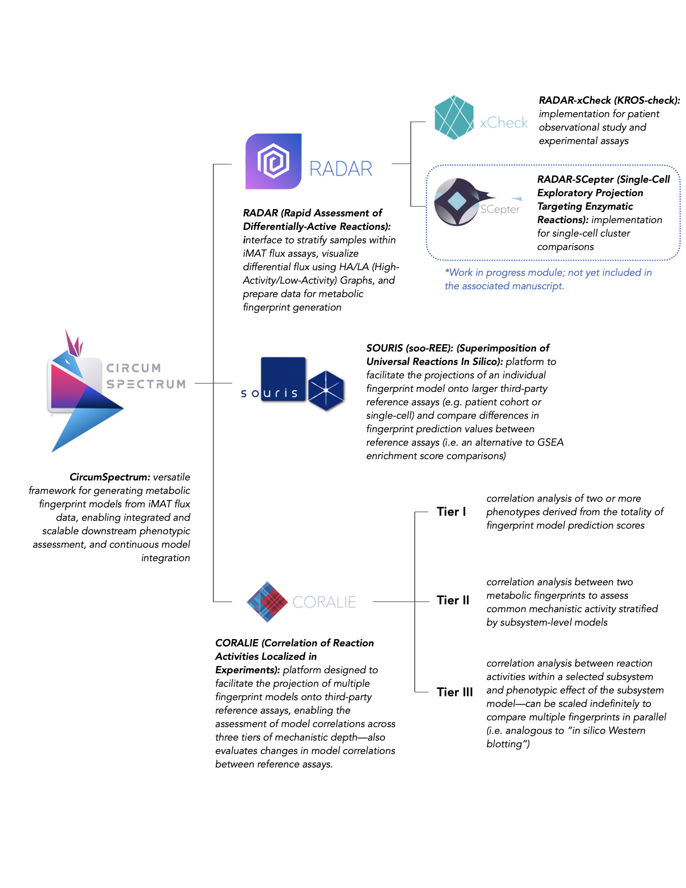

<p align="center">
  
</p>

<h1 align="center">CircumSpectrum</h1>

<p align="center">
  CircumSpectrum is a flux-based framework in R that converts bulk and single-cell RNA-seq data into metabolic fingerprints using genome-scale models and machine learning. It includes RADAR, SOURIS, and CORALIE modules for reaction-level, cross-cohort, and multi-tier correlation analyses.
</p>

<p align="center">
  The framework provides the following modules and associated datasets, with both TUI and GUI executables so you can start at any stage of the pipeline.
</p>

<p align="center">
  
</p>

---

## R dependencies

CircumSpectrum uses separate R dependency sets for:

- **Local / interactive use** (SOURIS and other Shiny GUIs).
- **Cluster-side applications** (fingerprint training, and large-scale batch jobs for iMAT).
- **Optional CPLEX support** via the `Rcplex` R interface.

All helper scripts are provided in the `src/` directory.

### Local (GUI) dependencies

To install the local GUI dependencies (for RADAR-xCheck, SOURIS, and CORALIE Shiny apps), run in R:

```r
source("src/install_local_dependencies.R")
```
This script installs all required CRAN packages for running the local Shiny applications.

### Cluster-side (Linux SLURM) dependencies

To install the dependencies needed on the cluster (imat_calibration and build_fingerprints from RADAR), run:

```r
source("src/install_cluster_dependencies.R")
```
This script installs the packages used by CircumSpectrum’s cluster-side workflows.

### CPLEX and Rcplex

The iMAT calibration workflows use the IBM CPLEX solver via the Rcplex R package.

Installing IBM CPLEX Optimization Studio

CPLEX itself must be installed system-wide; it is not managed by these R scripts.

Academic use (free):

    Register via IBM’s academic / SkillsBuild portal and request access to IBM ILOG CPLEX Optimization Studio.

    Download the installer for your platform and follow IBM’s installation instructions.

Non‑academic / production use:

    See the product page:
    https://www.ibm.com/products/ilog-cplex-optimization-studio

On clusters, CPLEX is often provided as a module, for example:

```bashscript
bash
module load cplex
```
Check your cluster documentation for the correct module name and version.
Installing the Rcplex R interface

Once CPLEX is installed and visible in your environment, you can install the R interface using:

```r
source("src/install_cplex_rcplex.R")
```
This script:

Checks for common CPLEX environment variables (e.g. CPLEX_STUDIO_DIR, CPLEX_STUDIO_LIB, CPLEX_PATH).

Installs Rcplex dependencies (e.g. slam, Matrix) if needed.

Attempts to install Rcplex from source and prints hints if compilation fails.

If Rcplex fails to compile:

Ensure the CPLEX module is loaded (module load cplex), with include and library paths correctly set.

If your site provides a prebuilt Rcplex tarball, you can install it manually, for example:

```r
install.packages("Rcplex_0.3-6.tar.gz", repos = NULL, type = "source")
```
Consult your cluster documentation or admins for site-specific details on CPLEX and Rcplex deployment.
