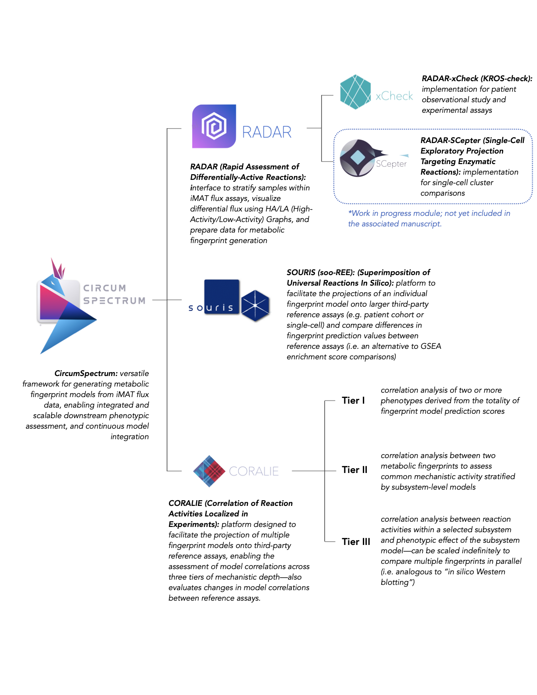

> <p align="center">
>   
> </p>
>
> <h1 align="center">CircumSpectrum</h1>
>
> <p align="center">
>   CircumSpectrum is a flux-based framework in R that converts bulk and single-cell RNA-seq data into metabolic fingerprints using genome-scale models and machine learning. It includes RADAR, SOURIS, and CORALIE modules for reaction-level, cross-cohort, and multi-tier correlation analyses.
> </p>
>
> <p align="center">
>   The framework provides the following modules and associated datasets, with both TUI and GUI executables so you can start at any stage of the pipeline.
> </p>
>
> # Module Descriptions
>
> <p align="center">
>   
> </p>
>
> ---
>
> ## R dependencies
>
> CircumSpectrum uses separate R dependency sets for:
>
> - **Local / interactive use** (SOURIS and other Shiny GUIs).
> - **Cluster-side applications** (fingerprint training, and large-scale batch jobs for iMAT).
> - **Optional CPLEX support** via the `Rcplex` R interface.
>
> All helper scripts are provided in the `src/` directory.
>
> ### Local (GUI) dependencies
>
> To install the local GUI dependencies (for RADAR-xCheck, SOURIS, and CORALIE Shiny apps), run in R:
>
> ```r
> source("src/install_local_dependencies.R")
> ```
>
> This script installs all required CRAN packages for running the local Shiny applications.
>
> ### Cluster-side (Linux SLURM) dependencies
>
> To install the dependencies needed on the cluster (imat_calibration and build_fingerprints from RADAR), run:
>
> ```r
> source("src/install_cluster_dependencies.R")
> ```
>
> This script installs the packages used by CircumSpectrum’s cluster-side workflows.
>
> ### CPLEX and Rcplex
>
> The iMAT calibration workflows use the IBM CPLEX solver via the `Rcplex2` R package from the RuppinLab GitHub repository, which extends the original CRAN Rcplex interface.
>
> **Important:** Only the **commerical** IBM ILOG CPLEX Optimization Studio (available free for academic accounts) has the necessary capabilities to run the iMAT flux 
> calibration at scale; the Community Edition is not sufficient.
>
> #### Installing IBM CPLEX Optimization Studio
>
> CPLEX itself must be installed system-wide; it is not managed by these R scripts.
>
> **Academic use (free):**
>
> - Register via IBM’s academic or SkillsBuild portal and request access to IBM ILOG CPLEX Optimization Studio (select the full Commercial Edition, not the Community Edition).
> - Download the installer for your platform and follow IBM’s installation instructions.
>
> On clusters, CPLEX is often provided as a module, for example:
>
> ```bash
> module load cplex
> ```
>
> Check your cluster documentation for the correct module name and version.
>
> Make a note of your CPLEX installation directory (e.g. CPLEX_STUDIO_DIR), as you will need it when installing Rcplex2.
>
> #### Installing the Rcplex R interface
>
> Once the professional CPLEX Optimization Studio is installed and visible in your environment, install Rcplex2 directly from the RuppinLab GitHub repository:
>
> ```bash
> git clone https://github.com/ruppinlab/Rcplex2.git
> ```
>
> Export <cplex_dir> to the parent directory that contains the cplex folder, for example:
> 
> ```bash
> export cplex_dir="/home/you/ibm/ILOG/CPLEX_Studio1210"
> ```
>
> From root directory, run:
>
> ```bash
> R CMD INSTALL \
>  --configure-args="PKG_CFLAGS='-fPIC -m64 -fno-strict-aliasing' \
>    PKG_CPPFLAGS=-I${cplex_dir}/cplex/include \
>    PKG_LIBS='-L${cplex_dir}/cplex/lib/x86-64_linux/static_pic \
>    -lcplex -lm -lpthread'" \
>  Rcplex2
> ```
>
> If installation fails (e.g. issues related to CPXversion or missing headers/libraries), consult the inst/INSTALL file in the Rcplex2 repository and your system/cluster
> documentation; some HPC systems provide preconfigured modules or prebuilt Rcplex2 binaries.
>
> ---
>
> ## Running Bash scripts on Windows
>
> The provided TUI/GUI launchers and helper scripts are written as Bash scripts and are designed for Unix-like shells (Linux, macOS). On Windows you can still use them without modification via either **Git Bash** or **Windows Subsystem for Linux (WSL)**, or by calling the underlying R entry points directly.
>
> ### Option 1: Git Bash (run Bash scripts on Windows)
>
> 1. **Install Git for Windows**
>    - Download from https://git-scm.com/download/win and install Git Bash.
>
> 2. **Open Git Bash in the repository**
>    - In Explorer, navigate to the CircumSpectrum repository.
>    - Right-click inside the folder and choose **“Git Bash Here”**.
>
> 3. **Run the Bash scripts as on Linux**
>    - For example:
>
>    ```bash
>    ./SOURIS_gui.sh
>    ./xCheck_gui.sh
>    ```
>
>    - If you see “Permission denied”, mark the script as executable:
>
>    ```bash
>    chmod +x SOURIS_gui.sh
>    chmod +x xCheck_gui.sh
>    ```
>
> 4. **Ensure Rscript is on the PATH**
>    - Install R for Windows from https://cran.r-project.org/.
>    - Make sure `Rscript.exe` is on your PATH so commands like:
>
>    ```bash
>    Rscript src/install_local_dependencies.R
>    ```
>
>    work from Git Bash.
>
> ### Option 2: Windows Subsystem for Linux (WSL)
>
> 1. **Open a WSL shell** (e.g. Ubuntu).
> 2. **Clone or access the repo inside WSL**, then:
>
>    ```bash
>    cd /path/to/CircumSpectrum
>    ./SOURIS_gui.sh
>    ./xCheck_gui.sh
>    ```
>
> 3. Install R and required system libraries inside WSL, separate from your Windows R installation.
>
> ### Option 3: Direct Rscript invocation on Windows
>
> If you prefer not to use Bash at all, you can call the underlying R scripts directly from Command Prompt or PowerShell:
>
> ```powershell
> Rscript src/install_local_dependencies.R
> Rscript src/install_cluster_dependencies.R
> Rscript SOURIS.R
> ```
>
> This bypasses the Bash wrappers, but the analyses and GUIs behave identically as long as the working directory is the project root and R can find the required scripts and data.
